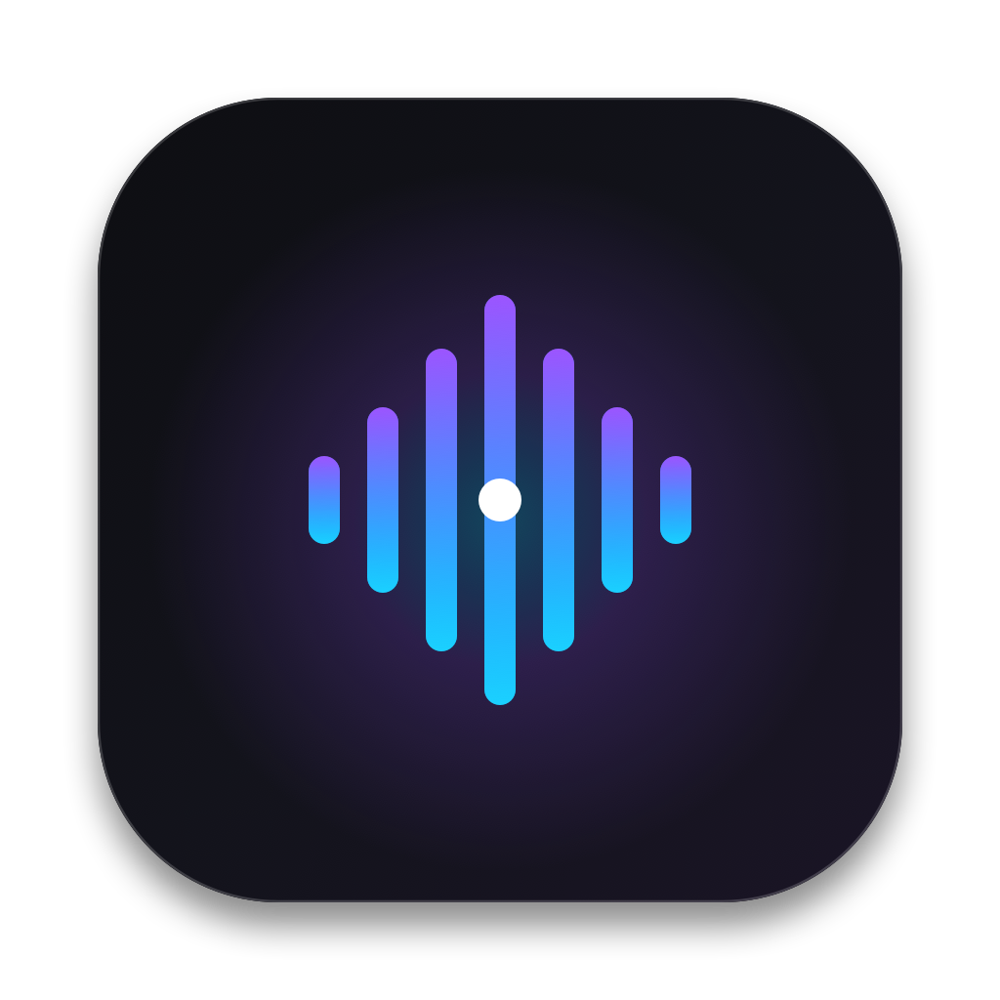
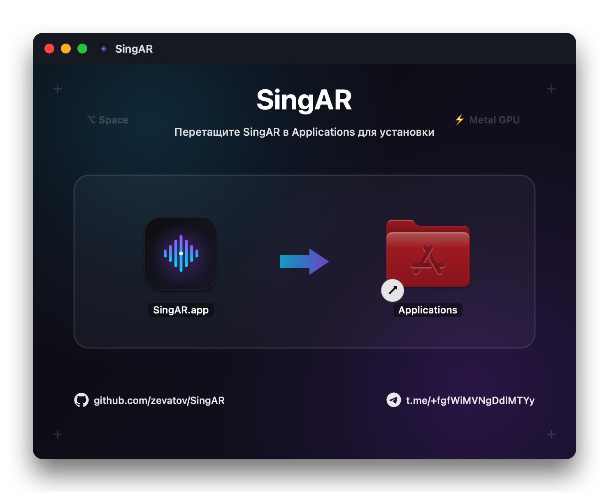

<div align="center">

# 🎙️ SingAR

**Высокопроизводительный нативный голосовой ввод, ассистент диктовки и vibe-кодинга для macOS**

[-black?style=for-the-badge&logo=apple&logoColor=white)](https://apple.com/macos)
[](https://swift.org)
[](https://developer.apple.com/metal/)
[](Tests/)
[](LICENSE)
[](https://github.com/zevatov/SingAR/releases)
[](https://t.me/+fgfWiMVNgDdlMTYy)

<br/>



<br/>

[ Скачать SingAR.dmg ](https://github.com/zevatov/SingAR/releases) • [ Возможности ](#-ключевые-возможности-v230) • [ Сравнение ASR ](#-сравнение-asr-движков) • [ Настройки ](docs/SETTINGS_GUIDE.md) • [ Установка ](#-установка) • [ Экосистема ](#-экосистема-нативных-утилит-для-macos) • [ Telegram ](https://t.me/+fgfWiMVNgDdlMTYy)

</div>

---

**SingAR** — это сверхбыстрый и легковесный инструмент голосового ввода, созданный специально для разработчиков и вайб-кодинга на macOS. Приложение работает в строке меню macOS, не занимает место в Dock и вызывается по удержанию одной клавиши (по умолчанию — **Правый ⌥ Option** или **Fn / Globe**).

SingAR расшифровывает речь, автоматически нормализует технический сленг, команды терминала (`git`, `docker`, `npm`), переменные `camelCase` / `snake_case` и пути к файлам, после чего вставляет готовый чистовик в активное окно редактора (Cursor, VS Code, Xcode, Терминал, браузер) за **1 миллисекунду**.

---

## 📊 Сравнение ASR-движков

| Движок | Где выполняется | Задержка | Приватность | Рекомендация |
|---|---|---|---|---|
| **Whisper Large Turbo** | Metal GPU (Локально) | ~1.2 с | 100% Offline | **Основной выбор:** полная приватность, 0 ключей, работает в самолёте и без сети |
| **Groq Whisper** | Groq LPUs (Облако) | ~500 мс | Cloud | Рекордно быстрая облачная диктовка (< 800 мс) |
| **Google Gemini 3.5** | Google AI Studio | ~1.0 с | Cloud (Free) | Превосходный контекст, русский сленг и бесплатный тариф |
| **OpenRouter GPT-4o Audio** | OpenRouter | ~1.5 с | Cloud | Точность расшифровки редких библиотек и сложных аббревиатур |

---

## ✨ Ключевые возможности v2.3.0

### 1. Whisper Large Turbo на Metal GPU (100% Offline)
Полная автономность и конфиденциальность: модель на 1.6 ГБ (`ggml-large-v3-turbo-q5_0.bin`) загружается и исполняется локально на нейроядрах и графическом процессоре Apple Silicon (M1/M2/M3/M4) с аппаратным ускорением Metal. Ваши фразы и код никуда не отправляются.

### 2. Полная изоляция Whisper (Zero Apple Speech Interference)
В версии 2.3.0 системный движок Apple Speech полностью изолирован и не запускается в фоне при выборе Whisper или облачных провайдеров (`NoopASREngine`). Реализован строгий принцип **Zero Silent Fallback**: если локальная модель ещё не скачана или произошёл сбой, система мгновенно и честно сообщает об этом в HUD, исключая скрытые подмены на неточный системный ввод.

### 3. Режим HUD-Only: моментальная вставка за 1 мс (Zero-Flicker)
В отличие от стандартных систем, печатающих черновик посимвольно в редактор и затем стирающих его длинной серией Backspace, SingAR поддерживает режим **HUD-Only** (`liveDraftMode = .hudOnly`):
- Во время речи промежуточный статус выводится только в парящую капсулу под строкой меню.
- В активный редактор не отправляется ни одного лишнего нажатия клавиш.
- После завершения речи готовый отполированный чистовик вставляется мгновенно через системный буфер обмена (`Cmd+V`) за **1 миллисекунду**. Никакого мерцания курсора и повреждения кода!

### 4. Нормализатор кода для вайб-кодинга (`CodeLexiconNormalizer`)
Встроенный движок понимает профессиональную речь программистов и преобразует фонетические конструкции в рабочий синтаксис:
- *«верблюжий регистр юзер нэйм»* ➔ `userName`
- *«змеиный регистр токен айди»* ➔ `token_id`
- *«нпм ран билд»* ➔ `npm run build`
- *«гит статус шорт»* ➔ `git status --short`
- *«точка енв»* ➔ `.env`
- *«докер компоуз ап»* ➔ `docker compose up -d`
- *«сайдбар точка тсикс»* ➔ `Sidebar.tsx`

### 5. Нативный индикатор macOS Fluid Droplet & Звуковая обратная связь
- Парящая темная капсула под строкой меню с живой визуализацией звуковой волны при записи, спиннером обработки и зелёным маркером вставки.
- Приятные нативные звуковые эффекты начала и завершения записи с возможностью быстрого отключения (**Mute / Unmute**) в 1 клик прямо из строки меню.

### 6. Smart Media Control
Автоматически ставит фоновое воспроизведение музыки или видео (Spotify, Apple Music, YouTube) на паузу при нажатии горячей клавиши и возобновляет звук после завершения фразы. В 2.3.1 возобновление известно как нестабильное (Known Issue) — подробности в [docs/release-notes-2.3.1.md](docs/release-notes-2.3.1.md).

### 7. Защита от обрезки речи (VAD Grace-Tail) и отмена по Esc
- Встроенный «хвост тишины» (`graceSeconds = 0.7`) в детекторе речевой активности гарантирует, что последнее слово не потеряется при быстром отпускании клавиши.
- Нажатие клавиши `Esc` в любой момент записи или обработки мгновенно отменяет сессию: в буфер и историю ничего не попадает, а вставка блокируется.

---

## ⌨️ Хоткеи

| Комбинация | Действие |
|---|---|
| **Правый ⌥ Option** *(по умолчанию)* | Удерживать для диктовки (Hold-to-Talk) |
| **Fn / Globe (🌐)** | Альтернативная клавиша диктовки |
| **Esc** | Мгновенная отмена диктовки без вставки |

*(Клавиши и режимы гибко перенастраиваются в окне настроек: иконка в строке меню → ⚙️ Настройки)*

Подробное описание параметров: 👉 **[Руководство по настройкам SingAR](docs/SETTINGS_GUIDE.md)**

---

## 🖥 Системные требования

- macOS 14.0 (Sonoma) или новее
- Компьютер Mac на базе Apple Silicon (M1, M2, M3, M4)
- Разрешения macOS:
  - **Микрофон** (для захвата аудио)
  - **Универсальный доступ / Accessibility** (для быстрой вставки текста в активное окно)

---

## 🚀 Установка

<div align="center">
  
</div>

1. Скачайте образ **[`SingAR.dmg`](https://github.com/zevatov/SingAR/releases)** и файл контрольной суммы **`SingAR.dmg.sha256`** из раздела [Releases](https://github.com/zevatov/SingAR/releases).
2. Откройте DMG и перетащите **SingAR** в папку **Applications**.
3. Запустите приложение из папки **Applications**. При первом запуске:
   - По иконке приложения нажмите **правой кнопкой мыши (Control-клик) → Открыть**, затем подтвердите в диалоге macOS Gatekeeper (типично для проектов с открытым исходным кодом без платной нотаризации Apple).
   - Предоставьте разрешения **Микрофон** и **Универсальный доступ** в «Системные настройки → Конфиденциальность и безопасность».
   - При запросе доступа к Keychain нажмите **«Разрешать всегда»** — это стандартный защищённый механизм macOS для хранения API-ключей.

---

## 🔄 Обновления

SingAR включает легковесную проверку обновлений:
- Сервис `@MainActor UpdateChecker` опрашивает официальные GitHub Releases и канал разработки [`t.me/+fgfWiMVNgDdlMTYy`](https://t.me/+fgfWiMVNgDdlMTYy).
- При выходе новой версии в окне настроек появляется индикатор со ссылкой на релиз.
- Никакой скрытой телеметрии и фонового сбора данных.

---

## 🗺️ Дорожная карта и Экосистема

### Экосистема нативных утилит для macOS
SingAR развивается как часть серии локальных, быстрых и приватных инструментов в нативном стиле Apple от [Stanislav Zevatov](https://github.com/zevatov):
- 🎙️ **[SingAR](https://github.com/zevatov/SingAR)** — нативный голосовой ввод, ассистент диктовки и vibe-кодинга для macOS (локальный Whisper + Metal, буфер обмена).
- ⌨️ **[ReTypeR](https://github.com/zevatov/ReTypeR)** — мгновенная умная автоконвертация раскладки клавиатуры без сети и задержек.

---

## 🔒 Приватность и безопасность

- **100% Offline по умолчанию:** в режиме Whisper Turbo аудиопоток обрабатывается исключительно локально на вашем Mac и никогда не передаётся в интернет.
- **Безопасное хранилище Keychain:** пользовательские API-ключи хранятся в системной связке ключей macOS с атрибутом `ThisDeviceOnly` и никогда не попадают в `UserDefaults` или лог-файлы.
- **Анонимизированные логи (SHA-seam):** локальный лог `~/Library/Application Support/SingAR/singar.log` не содержит расшифрованного текста диктовки — сохраняются только длительность и SHA-256 хэш.
- Подробная модель угроз и архитектурные границы доверия: 👉 **[`SECURITY.md`](SECURITY.md)**.

---

## 🛠 Сборка из исходников

```bash
# Клонирование репозитория
git clone https://github.com/zevatov/SingAR.git
cd SingAR

# Сборка debug-бинарника
swift build

# Запуск тестов
swift test

# Сборка готового релизного дистрибутива SingAR.dmg
./scripts/build_dmg.sh
```

---

## 📄 Лицензия & Авторство

- Код SingAR распространяется под лицензией **MIT** — см. [`LICENSE`](LICENSE).
- Сторонние компоненты и модели описаны в [`NOTICE.md`](NOTICE.md).
- Автор: [Stanislav Zevatov](https://github.com/zevatov)
- Telegram-сообщество: [`t.me/+fgfWiMVNgDdlMTYy`](https://t.me/+fgfWiMVNgDdlMTYy)
